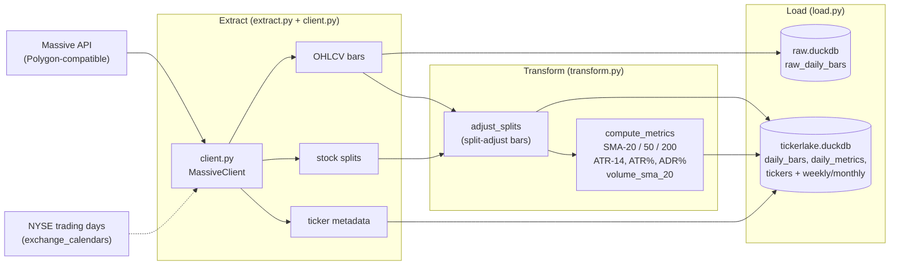

# tickerlake

ETL pipeline for US equity market data. Fetches daily OHLCV bars, stock splits, and ticker metadata from the [Massive API](https://github.com/Massive-Algo/massive), adjusts prices for splits, computes technical indicators, and stores everything in DuckDB.

## Pipeline



## Setup

Requires Python 3.14 and a `MASSIVE_API_KEY` environment variable.

```bash
uv sync
export MASSIVE_API_KEY=your_key_here
```

## Usage

```bash
uv run tickerlake backfill                          # Full 5-year historical load
uv run tickerlake backfill --start-date 2023-01-01  # Custom start date
uv run tickerlake update                            # Append new trading days
uv run tickerlake info                              # Show database metadata
```

## Output

Two DuckDB files in the working directory:

- **raw.duckdb** -- unadjusted daily bars (`raw_daily_bars`)
- **tickerlake.duckdb** -- split-adjusted bars (`daily_bars`), technical indicators (`stock_metrics`), and reference data (`tickers`)

## Stack

Python 3.14, [Polars](https://pola.rs/) for data processing, [DuckDB](https://duckdb.org/) for storage, [exchange_calendars](https://github.com/gerrymanoim/exchange_calendars) for NYSE trading day resolution.